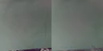

# RoboMimic Rollout Demo

A minimal, readable implementation of [DreamerV3](https://arxiv.org/abs/2301.04104) trained on robot manipulation data from [robomimic](https://robomimic.github.io/).

The world model learns to imagine future wrist-cam frames from a 7-DOF robot arm performing the Lift task, conditioned on real actions.

## Rollouts

Ground truth (left) vs. model imagination (right) after 20k training steps:

**Latest rollout**


**First rollout**


## Architecture

The world model is a Recurrent State Space Model (RSSM) with three state variables:
- `e` — encoded observation (4-layer CNN encoder)
- `h` — deterministic recurrent state (GRU)
- `z` — stochastic latent state (MLP, prior or posterior)

## Setup

```bash
python -m venv .venv && source .venv/bin/activate
pip install -r requirements.txt
```

## Usage

```bash
# Train on robomimic Lift wrist-cam data
python train.py

# Visualize imagination rollout after training
python rollout.py --checkpoint checkpoint.pt --hdf5 demo.hdf5 --demo demo_0 --burn_in 5 --horizon 45
open rollout.mp4
```
